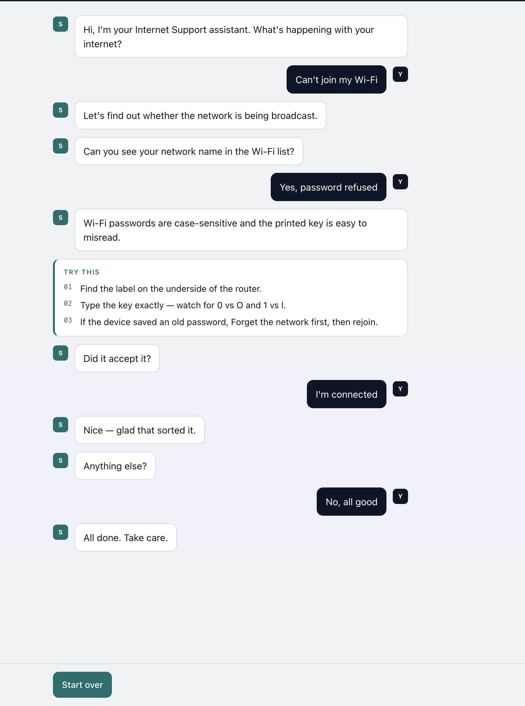
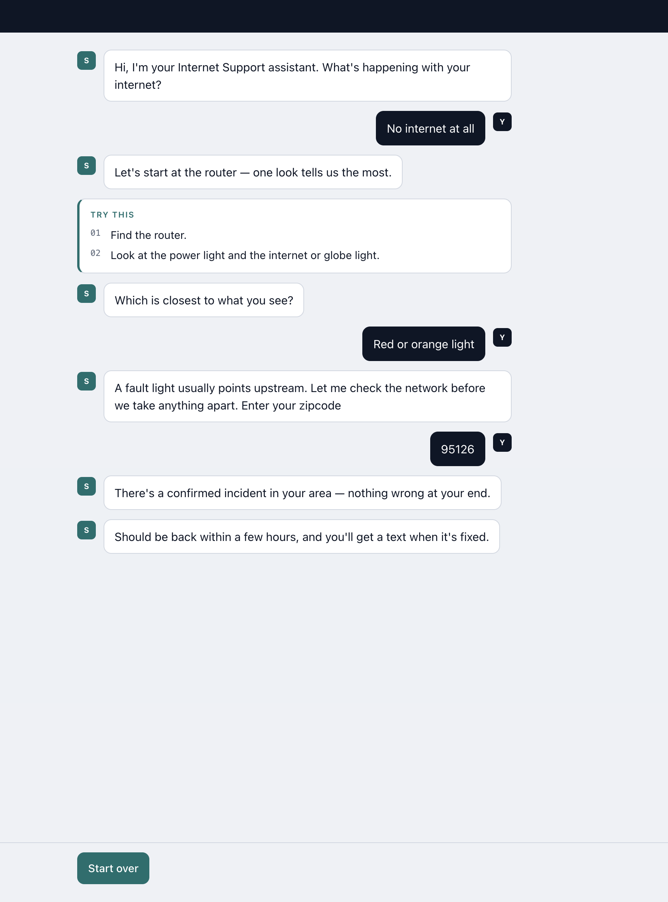
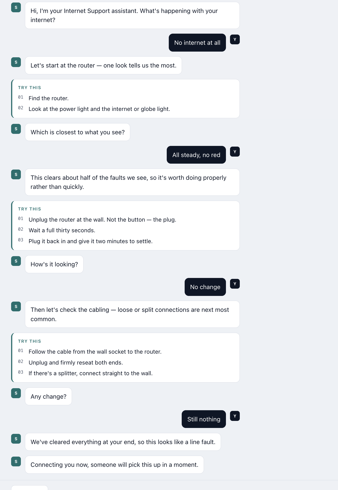
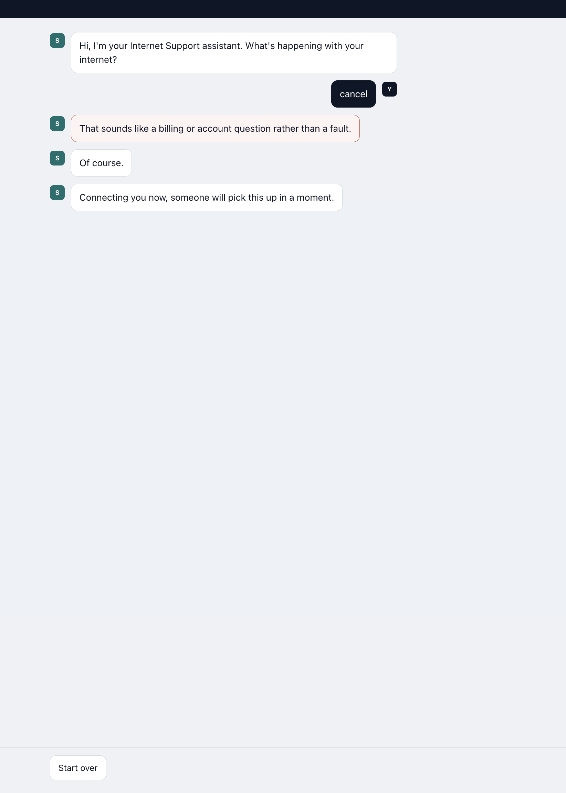
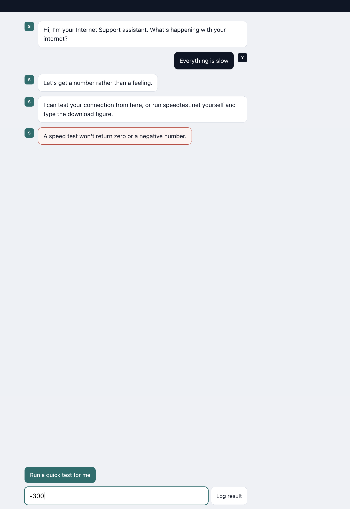
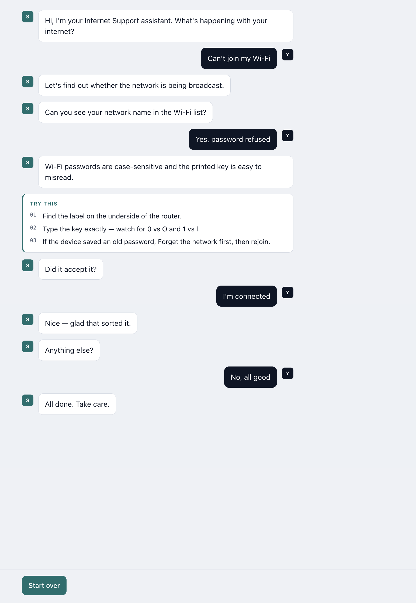

Technical Support chatbot for a home ISP, Customer Service Chatbot.

No build step, no dependencies, no framework. Three plain files.

Double-click `index.html`. It runs directly from `file://` in any modern
browser.

**Alternative — serve it locally:**

```bash
python3 -m http.server 5500
```

Then open <http://localhost:5500>.


## Approach

This chatbot is designed around one goal:

**When the bot cannot solve the problem, can it still make the customer’s experience easier?**

The goal is not to keep customers trapped in troubleshooting. The bot guides them through a small number of clear checks, avoids repeating steps they have already completed, and offers human support when continuing would no longer be useful.

### Simple, flexible conversations

At each step, customers can:

- Select a suggested response
- Type their own answer
- Skip a step they have already tried
- Ask to speak with an agent

This gives customers structure without forcing them through a rigid conversation.

### Helpful troubleshooting

The bot focuses on common internet problems:

- No internet connection
- Slow connection
- Unable to join Wi-Fi

It asks one question at a time and explains each action in clear language. Customers are not expected to understand technical terms or diagnose the issue themselves.

### Proactive human support

After two unsuccessful troubleshooting steps, the bot offers to connect the customer with a person.

The customer can either:

- Continue troubleshooting
- Speak with an agent immediately

If they continue, the conversation resumes from the same point instead of restarting.

Customers can also request an agent at any stage.

### Edge-case handling

The chatbot handles several situations that may interrupt a normal troubleshooting flow.

**Billing and account requests**

Requests such as “I was charged twice,” “cancel my contract,” or “change my plan” are recognized as account issues and routed directly to the appropriate support team.

**Ambiguous responses**

When a response could match more than one problem, the bot does not guess. It displays the possible choices and asks the customer to select the closest one.

**Unrecognized responses**

If the chatbot cannot understand an answer, it provides a clear message and keeps the available options visible so the customer can continue.

**Invalid speed-test results**

The chatbot explains the specific problem when the customer enters:

- No value
- Text instead of a number
- Zero or a negative number
- An implausibly high result

The customer can correct the value without restarting the conversation.


### outcomes

The conversation ends with an appropriate next step:

- The connection is restored
- A possible router hardware problem is identified
- A possible line or service fault is identified
- The customer is transferred to an agent
- A billing or account request is routed to the correct team
- A safety-related issue is escalated immediately

The chatbot does not continue asking questions once troubleshooting is no longer helpful.


## Screenshots Example

### Can't joint Wifi, password is incorrect


### Area outage


### Giving trouble shoot tip, connect to agent when repeartly fail


### Edge Case, request to cancel contract


### Edge Case, slow connection, user give negative value of speed


### Sucessful trouble shooting

